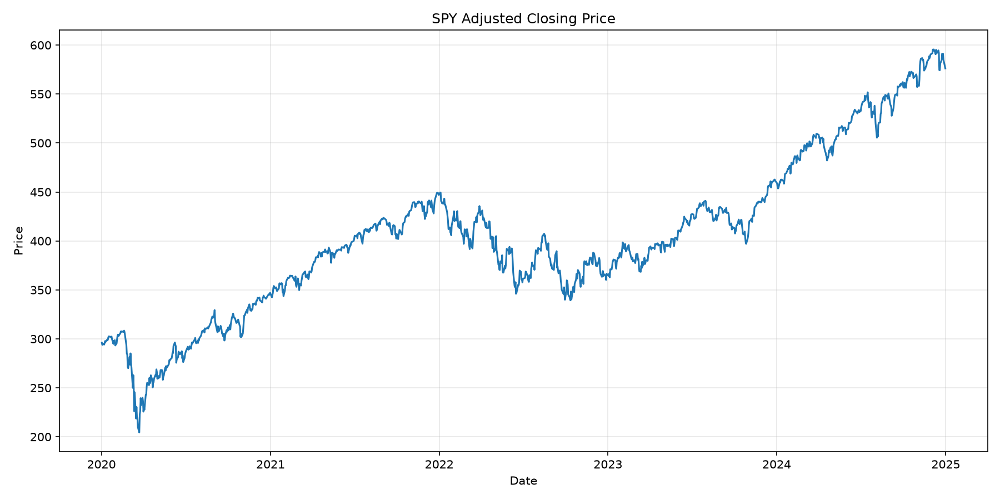
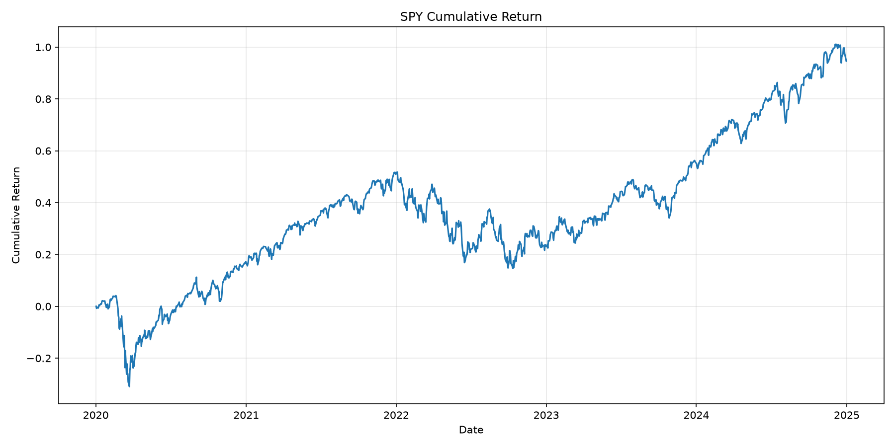
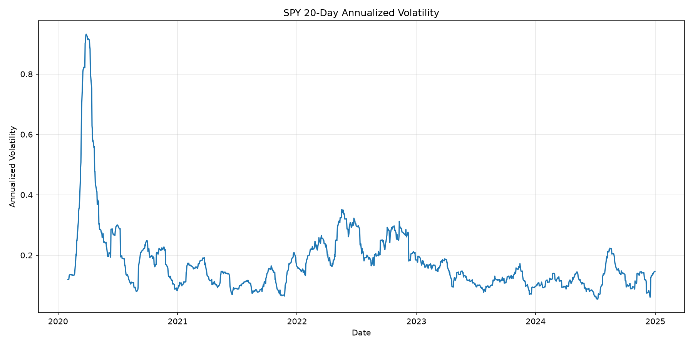
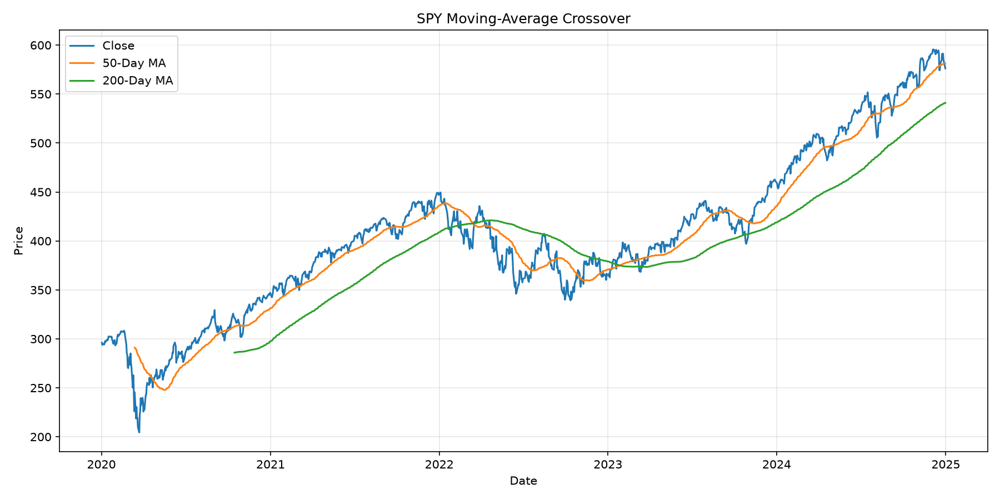
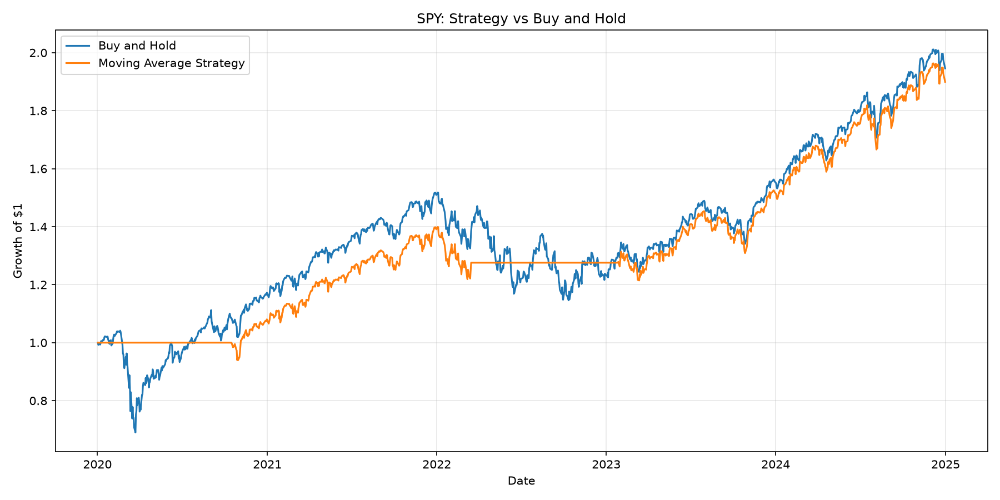

# Quant Research Lab

A practical research repository for quantitative finance, machine learning, and reproducible experiments.

## Goals

- Explore financial datasets
- Build and evaluate quantitative signals
- Test machine-learning models
- Document experiments and results
- Create a portfolio-ready research project

## Project Structure

```text
quant-research-lab/
├── data/
│   ├── raw/
│   └── processed/
├── notebooks/
├── src/
│   └── quant_research/
├── tests/
├── .gitignore
├── requirements.txt
└── README.md
```

## Setup

```bash
git clone https://github.com/4mir4bbas/quant-research-lab.git
cd quant-research-lab

python -m venv .venv
```

Activate the virtual environment:

**Windows (PowerShell)**

```powershell
.venv\Scripts\Activate.ps1
```

**macOS/Linux**

```bash
source .venv/bin/activate
```

Install dependencies:

```bash
pip install -r requirements.txt
```

## Current Status

The repository structure and development environment are being initialized.

## Planned Work

- [ ] Select the first research question
- [ ] Add a data-loading pipeline
- [ ] Perform exploratory data analysis
- [ ] Implement a baseline strategy
- [ ] Add backtesting and evaluation metrics
- [ ] Write tests
- [ ] Document results

## Disclaimer

This project is for research and educational purposes only and is not financial advice.


## Results

### Adjusted Closing Price



### Cumulative Return



### Rolling Volatility




### Moving-Average Strategy

The baseline strategy takes a long position when the
50-day moving average is above the 200-day moving average.



### Strategy Performance

The strategy is compared with a passive buy-and-hold benchmark.


